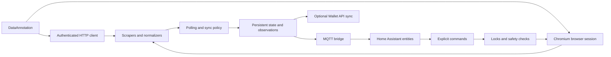

# DataAnnotation Home Assistant Add-on

An event-driven TypeScript service that ingests DataAnnotation worker and earnings data, normalizes it into operational state, and publishes live telemetry to Home Assistant over MQTT.

This is an unofficial integration designed to run privately with the user's own credentials inside Home Assistant; it is not a hosted service.

[](https://my.home-assistant.io/redirect/supervisor_store/?repository_url=https%3A%2F%2Fgithub.com%2Fdani-rodr%2Fdataannotation-ha-addon)

## Features

- Authenticated ingestion from structured endpoints with browser automation fallback
- Parsing and normalization of changing upstream payloads into stable internal models
- Stateful reconciliation of payments, payout estimates, work intervals, and project deltas
- Near-real-time event delivery through MQTT with retained state and Home Assistant discovery
- Scheduled and expedited refresh policies for different data freshness requirements
- Guarded external actions with persistent locks, explicit controls, and notifications
- Containerized deployment for `amd64` and `aarch64`, with CI validation and fixture tests

The service is built with Node.js 20, TypeScript, MQTT, Puppeteer, and esbuild.

## Architecture



The main runtime is `src/app/dataannotation_app.ts`. Client adapters isolate authentication and upstream access, `src/scrapers/` converts responses into application data, `src/state/` handles durable observations and reconciliation, and `src/integrations/mqtt_bridge.ts` exposes the result as a Home Assistant device.

## Design Notes

### Resilient ingestion

The service prefers authenticated HTTP/API data for payments and recent work, while using a persistent Chromium profile for pages that require browser access. It detects expired sessions, performs the login flow again, and continues polling. HTTP status handling, JSON parsing, and payload-shape validation prevent malformed upstream data from silently becoming valid-looking telemetry.

### Freshness-aware synchronization

Not every dataset needs the same cadence. Lightweight project and payment data can use normal or fast polling, while Funds History refreshes on a slower schedule. When an in-progress task ends, the service can schedule one expedited refresh. This keeps the common path responsive without repeatedly requesting the expensive history endpoint.

### State reconciliation instead of blind replacement

Payout observations retain first-seen estimates so a later, less precise scrape does not downgrade a previously useful timestamp. Work intervals are reconstructed from timed entries, converted to the configured timezone only at calendar boundaries, and split across midnight or week boundaries. These are examples of preserving data quality across incomplete or changing observations.

### Event-driven integration

The MQTT bridge publishes retained discovery and state topics, handles reconnects, and subscribes to explicit command topics. Project sensors, payment metrics, work-hours summaries, and control entities are available in Home Assistant without requiring a custom frontend.

### Safety boundaries

Project and payment telemetry is read-only by default. Claiming projects, automatic acceptance, and wallet writes are separate controls. Withdrawal remains behind a persistent lock and availability checks, and blocked attempts create a Home Assistant notification. Wallet writes are disabled by default in `config.yaml`.

## Project Structure

| Component | Location |
|------|-----------------------------|
| Data ingestion | `src/clients/`, `src/scrapers/` |
| Data quality and reconciliation | `src/state/`, `src/projects/` |
| Streaming and APIs | `src/integrations/mqtt_bridge.ts`, `src/clients/` |
| Scheduling and automation | `src/shared/polling_schedule.ts`, `src/app/` |
| Persistence | JSON observations and lock state under `/data` |
| Deployment | `Dockerfile`, `build.yaml`, Home Assistant add-on metadata |
| Testing | `test/unit/`, fixture integration tests, live read-only test |
| CI/CD | `.github/workflows/test.yml` |

## Installation

Use the Home Assistant shortcut above, or add this repository URL in Home Assistant:

`https://github.com/dani-rodr/dataannotation-ha-addon`

The add-on requires DataAnnotation credentials and an MQTT service. Configuration options are defined in `config.yaml`; detailed behavior is documented in [DOCS.md](DOCS.md).

## Configuration

| Option | Default | Description |
|--------|---------|-------------|
| `profile` | required | Friendly name shown in MQTT device metadata |
| `email` | required | DataAnnotation login email |
| `password` | required | DataAnnotation login password |
| `poll_cron` | `*/5 * * * *` | Normal polling schedule |
| `fast_poll_cron` | `*/5 * * * * *` | Schedule while Fast Polling is enabled |
| `funds_history_cron` | `*/30 * * * *` | Funds History API refresh schedule |
| `funds_history_after_task_delay_minutes` | `2` | Delay before an expedited history refresh |
| `work_hours_timezone` | `home_assistant` | Home Assistant timezone or an IANA timezone |
| `work_hours_week_start` | `monday` | First day of the work-hours week |
| `excluded_project_patterns` | `""` | Newline-separated project substrings to ignore |
| `mqtt_topic_prefix` | `dataannotation` | Base MQTT topic prefix |
| `log_level` | `info` | Logging level |
| `wallet_write_enabled` | `false` | Opt-in Wallet record synchronization |

## Local development and testing

Create a local credential file only when running live tests:

```bash
cp integration.local.example.json integration.local.json
```

The local file is ignored by Git. Environment variables are also supported: `DATAANNOTATION_EMAIL`, `DATAANNOTATION_PASSWORD`, and, for the opt-in Wallet test, `WALLET_TOKEN`.

```bash
npm ci
npm test
npm run test:integration:fixture
npm run typecheck
npm run build
```

The live browser test is read-only and runs only when credentials and a Chrome executable are available:

```bash
npm run test:integration:live
```

The Wallet live write/delete test is intentionally separate and must never be treated as a normal CI test. It performs external mutations and is opt-in through the dedicated workflow and credentials.

## Security and operational notes

- Never commit `integration.local.json`, browser profiles, access tokens, or real credentials.
- Keep this add-on on a trusted Home Assistant/MQTT network.
- Wallet synchronization is disabled by default; enable it only after reviewing the target account and category configuration.
- Browser-based authentication uses a persistent profile under `/data/chrome-profile`.
- Lock state, fast-polling state, auto-accept state, currency state, and work-hour observations persist under `/data` so restarts do not erase safety decisions or derived observations.
- The project intentionally does not provide a public hosted instance because it handles private account sessions and optional financial writes.

## Home Assistant entities

Discovery creates profile, status, sync, polling, claim, withdrawal, currency, work-hours, project, and payment entities, including one sensor and claim button per active project. Project sensors expose task count plus attributes such as pay, priority pay, tags, category, and creation time. See [DOCS.md](DOCS.md) for the complete behavior and entity details.
